# Module3_Challenge_Bitcoin

This Jupyter notebook contains the code for my data collection, preparation, and analysis, including all visualizations.  As Bitcoin trades on markets across the globe, this code capitalizes on simultaneous price dislocations in those markets by using the powers of Pandas.  

## To accomplish this task, the following phases of financial analysis were followed:
>
    1.  Collect CSV data in a Jupyter notebook file.
    2.  Prepare the datasets for analysis by cleaning missing and erroneous data.
    3.  Analyze the data at a high level through summary statistics and visualizations, and use
        this information to select areas for deeper analysis. Specifically, you’ll select time 
        periods in which to identify arbitrage opportunities.

            The analysis consists of the following tasks:

            a.  Choose the columns of data on which to focus the analysis.
            b.  Get the summary statistics and plot the data.
            c.  Focus the analysis on specific dates.
            d.  Calculate the arbitrage profits."

---

## Technologies

This project leverages python 3.7 with the following packages:

* [%matplotlib inline] 

---

## Installation Guide

Before running the application first install the following dependencies.

```python
%matplotlib inline
```

---

## Analysis

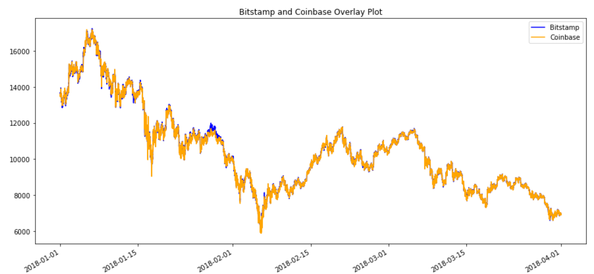

Based on these visualizations, the degree of spread has not changed much over the course of the few months.  The overlay showing all the data only shows a small number of times where one market is deviates from the other.  

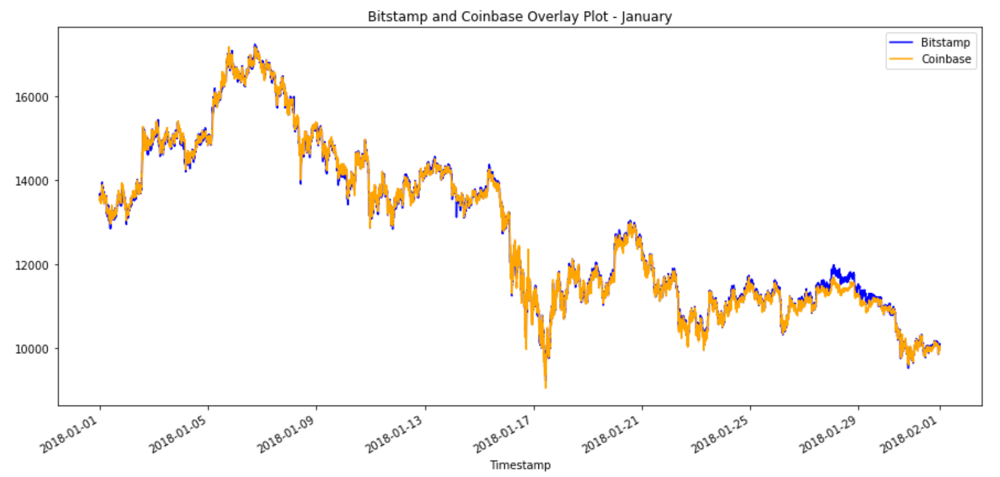

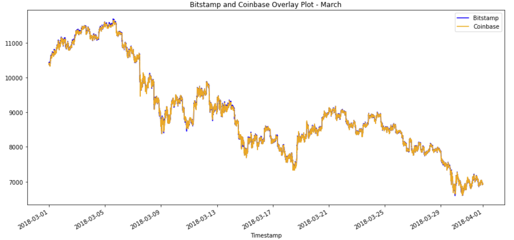

When zoomed in to specific time periods(months), the degree of spread is visible.  However, one is not able to make calculations from those visualizations.

### THREE RANDOM SAMPLES

[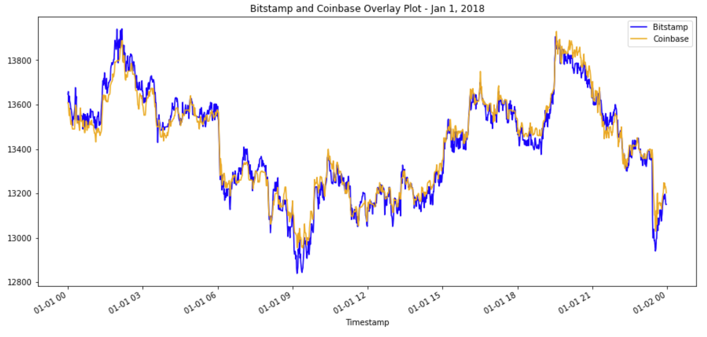](./Resources/Early_day_zoom.png)

| Overall Stats | Profitable trades > 1% | Cumulative Sum |
|:--------:|:--------:|:--------:|
| [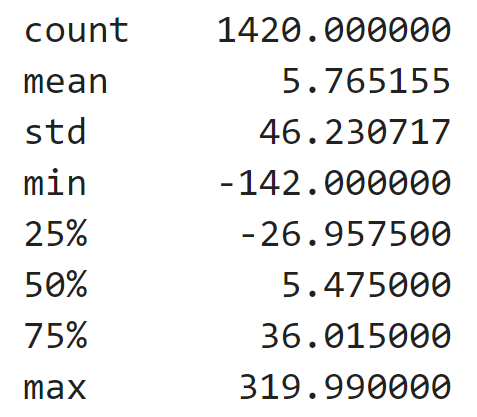]        | [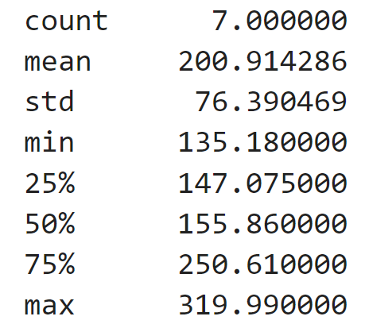]        | [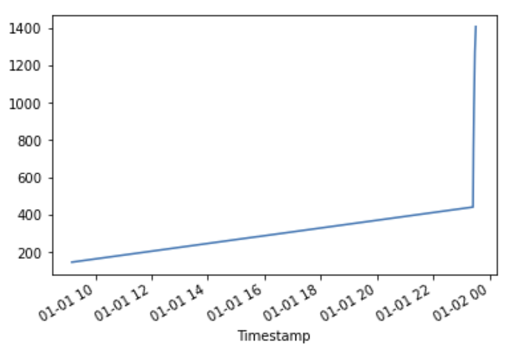]        |
    
---

[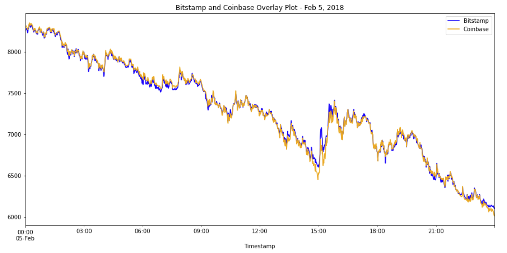](./Resources/Middle_day_zoom.png)[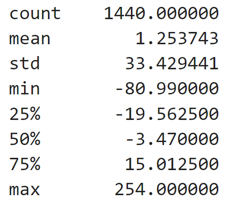](./Resources/Middle_day_stats.png)

[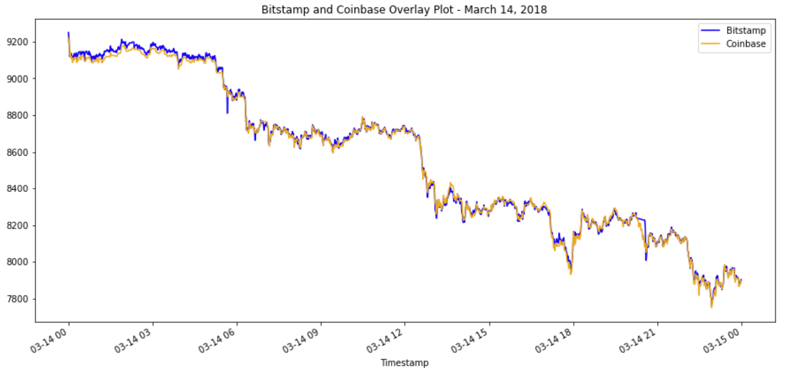](./Resources/Late_day_zoom.png)[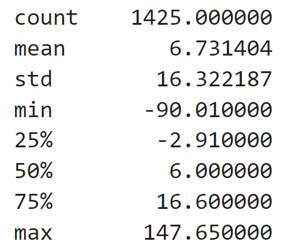](././Resources/Late_day_stats.png)

Based on the three dates I chose, late in the day and overnight prices vary more than 
during the business day so there is opportunity to make profit between 14:00 and 23:59.

---

## Contributors

Brought to you by Tracie Stipp.

---

## License

MIT