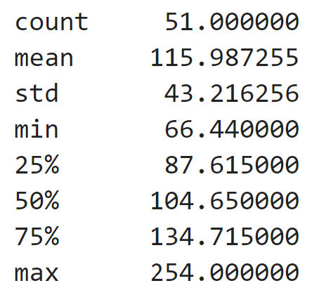
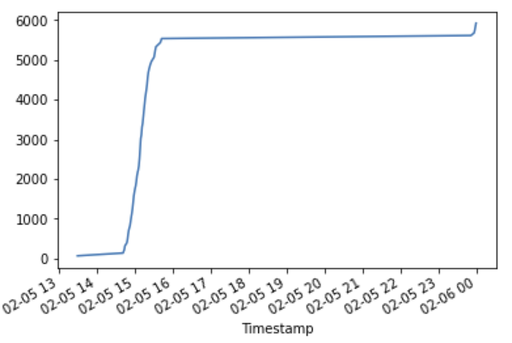
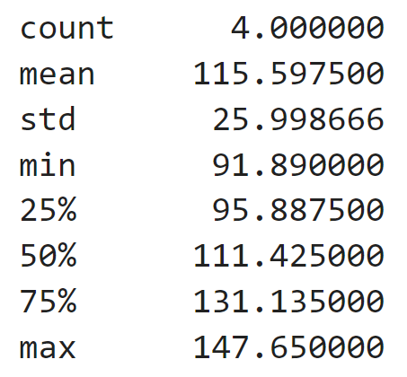
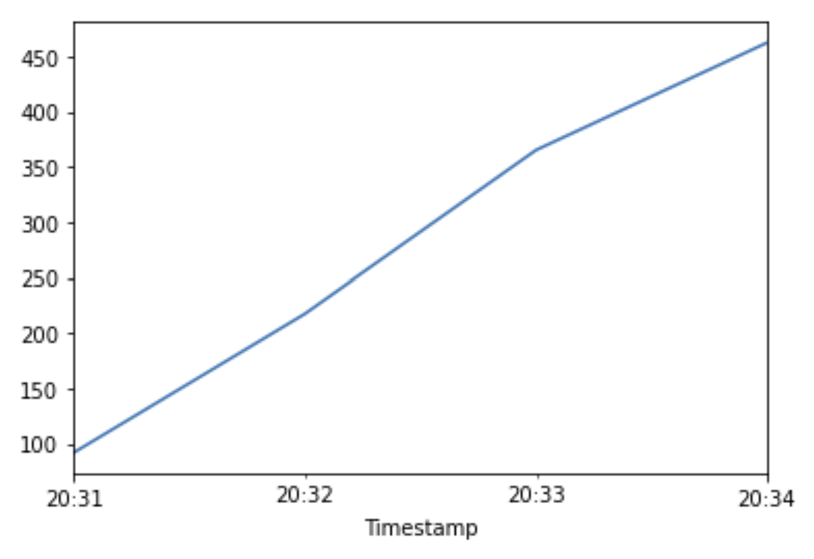

# Module3_Challenge_Bitcoin

This Jupyter notebook contains the code for my data collection, preparation, and analysis, including all visualizations.  As Bitcoin trades on markets across the globe, this code capitalizes on simultaneous price dislocations in those markets by using the powers of Pandas.  

To accomplish this task, the following phases of financial analysis were followed:

    1.  Collect CSV data in a Jupyter notebook file.
    2.  Prepare the datasets for analysis by cleaning missing and erroneous data.
    3.  Analyze the data at a high level through summary statistics and visualizations, and use
        this information to select areas for deeper analysis. Specifically, you’ll select time 
        periods in which to identify arbitrage opportunities.

            The analysis consists of the following tasks:

            a.  Choose the columns of data on which to focus the analysis.
            b.  Get the summary statistics and plot the data.
            c.  Focus the analysis on specific dates.
            d.  Calculate the arbitrage profits.

---

## Technologies

This project leverages python 3.7 with the following:

* [%matplotlib inline] - [A magic function in IPython](https://stackoverflow.com/questions/43027980/purpose-of-matplotlib-inline)

---

## Installation Guide

Before running the application first install the following dependencies.

```python
%matplotlib inline
```
---

## Analysis Report


Based on these visualizations, the degree of spread has not changed much over the course of the few months.  The overlay showing all the data only shows a small number of times where one market is deviates from the other.  


When zoomed in to specific time periods(months), the degree of spread is visible.  However, one is not able to make calculations from those visualizations.

### THREE RANDOM DAY SAMPLES

To better visualize and analyze opportunities for arbitrage, smaller slices of the data were sampled. Daily slices were taken from the beginning, middle and end of the time period given.

Early Day - January 1, 2018

]

| Overall Stats | Profitable trades > 1% | Cumulative Sum |
|:--------:|:--------:|:--------:|
|         |         |  
Total Profit = $1406.40       |
    
Middle Day - February 5, 2018

[](./Resources/Middle_day_zoom.png)

| Overall Stats | Profitable trades > 1% | Cumulative Sum |
|:--------:|:--------:|:--------:|
|         |         |  
Total Profit = $5915.35       |

Late Day - March 14, 2018

[](./Resources/Late_day_zoom.png)

| Overall Stats | Profitable trades > 1% | Cumulative Sum |
|:--------:|:--------:|:--------:|
|         |         |  
Total Profit = $462.39       |


While the first and last day chosen have a higher mean overall, they had a fewer number of profitable trades.  The first day had a mean profit per trade of $200.19 but only had 7 profitable trades for a total profit of $1406.40.  A good day!  The middle day had a mean profit of $115.98 per trade, with 51 profitable trades for a total profit of $5915.35. A VERY good day!  The last day had a mean profit per trade of $115.60 but only had 4 profitable trades, for a total profit of $462.39.  Profitable, but not the best.

Based on the three dates I chose, it is noticeable that late in the day and overnight prices vary more than during the business day so there is opportunity to make profit between 14:00 and 23:59.

---

## Contributors

Brought to you by Tracie Stipp.

---

## License

MIT